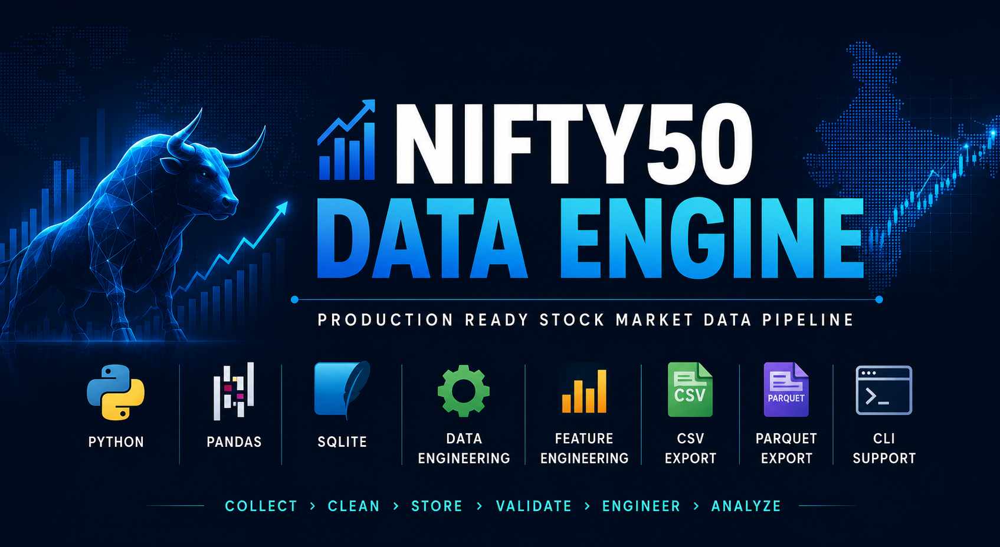
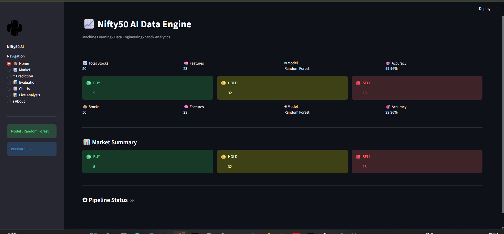
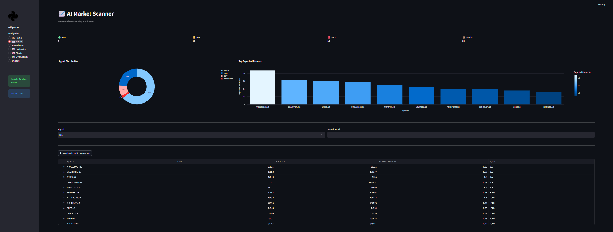
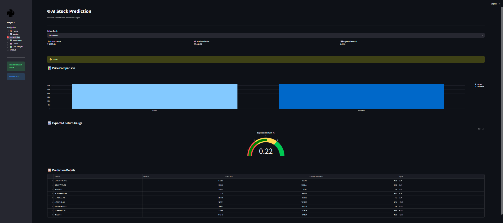
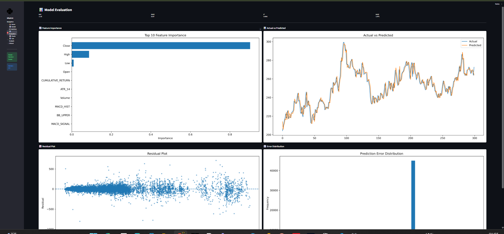
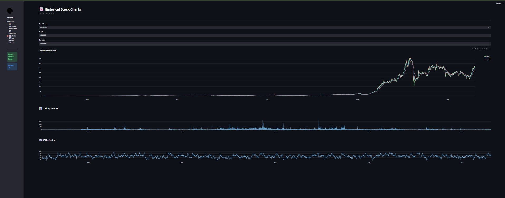
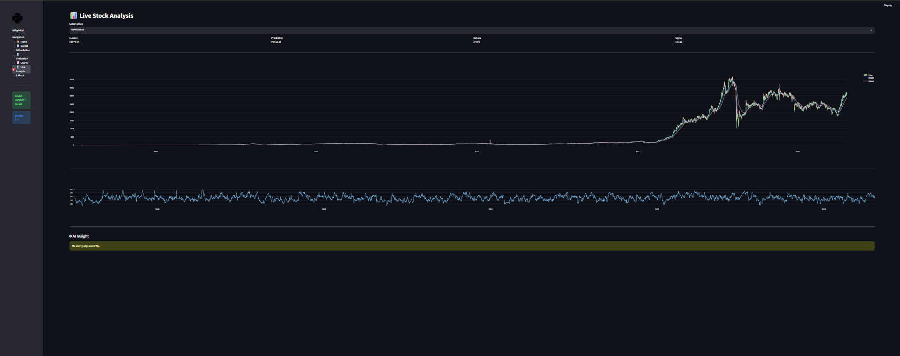

<p align="center">
  
</p>

<h1 align="center">📈 Nifty50 AI Data Engine</h1>

<p align="center">
<b>Production-Ready End-to-End Data Engineering, Machine Learning & AI Stock Analytics Platform</b>
</p>

<p align="center">


</p>

---

# 🚀 Overview

Nifty50 AI Data Engine is a production-ready Machine Learning and Data Engineering platform designed for the Indian stock market.

The project automates the complete workflow from collecting historical stock data to generating AI-powered stock predictions through an interactive dashboard.

The platform demonstrates an end-to-end ML pipeline inspired by real-world data engineering and machine learning practices.

---

# 🎯 Project Objectives

- Automate historical stock data collection
- Build a reusable data engineering pipeline
- Generate technical indicators
- Train machine learning models
- Evaluate prediction performance
- Generate AI-powered stock predictions
- Perform portfolio backtesting
- Visualize insights through Streamlit Dashboard

---

# 📊 Project Statistics

| Metric | Value |
|---------|------:|
| Stocks Covered | 50 |
| Historical Data | 2000 – Present |
| Dataset Size | 275,000+ Rows |
| Engineered Features | 23 |
| Machine Learning Model | Random Forest Regressor |
| Database | SQLite |
| Dashboard | Streamlit |
| Charts | Plotly + Matplotlib |
| Prediction Engine | AI Powered |
| Backtesting | Portfolio Simulation |

---

# 🧠 Machine Learning Performance

| Metric | Score |
|---------|------:|
| R² Score | **0.9996** |
| MAE | **11.92** |
| RMSE | **33.86** |
| MAPE | **1.87%** |

---

# 📸 Dashboard Preview

## 🏠 Home Dashboard

<p align="center">

</p>

---

## 📈 AI Market Scanner

<p align="center">

</p>

---

## 🤖 AI Stock Prediction

<p align="center">

</p>

---

## 📊 Model Evaluation

<p align="center">

</p>

---

## 📉 Historical Charts

<p align="center">

</p>

---

## 📡 Live Stock Analysis

<p align="center">

</p>

---

# ⭐ Project Highlights

- 📥 Historical NIFTY50 Stock Downloader
- 🧹 Automated Data Cleaning & Validation
- 🗄 SQLite Database Integration
- 📈 23 Technical Indicators
- 🤖 Random Forest Regression Model
- 📊 Model Evaluation Metrics
- 💹 AI Stock Prediction Engine
- 📉 Market Scanner Dashboard
- 💼 Portfolio Backtesting
- 📱 Interactive Streamlit Dashboard
- 📂 Modular Project Architecture
- ⚡ Command Line Interface (CLI)

---

# 🏗️ System Architecture

```text
                            Yahoo Finance
                                  │
                                  ▼
                     Historical Data Downloader
                                  │
                                  ▼
                         Data Validation
                                  │
                                  ▼
                           Data Cleaning
                                  │
                                  ▼
                         SQLite Database
                                  │
                                  ▼
                     Feature Engineering Pipeline
                                  │
                                  ▼
                       Machine Learning Dataset
                                  │
                                  ▼
                 Random Forest Model Training
                                  │
                                  ▼
                      Model Evaluation Metrics
                                  │
                                  ▼
                     AI Prediction Engine
                                  │
                 ┌────────────────┴────────────────┐
                 ▼                                 ▼
        Portfolio Backtesting          Streamlit Dashboard
```

---

# ✨ Features

## 📥 Data Engineering

### Historical Data Downloader

- Download complete NIFTY50 historical data
- Automatic retry mechanism
- Multi-stock downloader
- Progress tracking
- CSV generation

---

### 🧹 Data Validation

- Duplicate detection
- Missing value detection
- Invalid date validation
- Invalid price detection
- Invalid volume detection
- Dataset quality checks

---

### 💾 Database

- SQLite Database
- Fast SQL Queries
- Structured Data Storage
- Easy Data Retrieval

---

# 📈 Feature Engineering

The pipeline automatically generates technical indicators.

### Trend Indicators

- SMA 20
- SMA 50
- SMA 100
- SMA 200

- EMA 20
- EMA 50
- EMA 200

---

### Momentum Indicators

- RSI (14)

- MACD

- MACD Signal

- MACD Histogram

---

### Volatility Indicators

- Bollinger Upper Band

- Bollinger Middle Band

- Bollinger Lower Band

- ATR (14)

---

### Return Features

- Daily Return

- Log Return

- Cumulative Return

---

# 🤖 Machine Learning

Current Model

- Random Forest Regressor

Machine Learning Pipeline

- Dataset Preparation
- Target Variable Creation
- Feature Selection
- Train/Test Split
- Model Training
- Prediction
- Model Evaluation
- Model Saving (Joblib)

---

# 📊 Dashboard Features

The Streamlit dashboard contains the following pages.

## 🏠 Home

- Project Overview
- KPI Cards
- Pipeline Status
- Project Summary

---

## 📈 Market Scanner

- BUY Signals
- HOLD Signals
- SELL Signals
- Expected Returns
- Market Summary

---

## 🤖 Prediction

- Stock Selection
- Current Price
- Predicted Price
- Expected Return
- AI Signal
- Gauge Chart

---

## 📊 Evaluation

- MAE
- RMSE
- R² Score
- MAPE

- Feature Importance

- Actual vs Predicted

- Residual Plot

- Error Distribution

---

## 📉 Historical Charts

- Price Chart
- EMA20
- EMA50
- Trading Volume
- RSI Indicator

---

## 📡 Live Stock Analysis

- Live Prediction
- Current Price
- Expected Return
- AI Signal
- Interactive Charts

---

## 💼 Portfolio Backtesting

- Portfolio Simulation
- Investment Analysis
- BUY/HOLD/SELL Statistics
- Final Portfolio Value

---

# 📂 Project Structure

```text
Nifty50-AI-Data-Engine/
│
├── app.py
├── main.py
├── requirements.txt
├── README.md
├── LICENSE
│
├── config/
│
├── scraper/
│
├── database_manager/
│
├── features/
│
├── ml/
│
├── dashboard/
│   ├── pages/
│   ├── components/
│   └── styles.py
│
├── backtesting/
│
├── models/
│
├── reports/
│
├── database/
│
├── data/
│
├── images/
│
└── tests/
```

---

# 🛠️ Tech Stack

| Category | Technology |
|-----------|------------|
| Programming | Python |
| Data Analysis | Pandas, NumPy |
| Machine Learning | Scikit-learn |
| Dashboard | Streamlit |
| Visualization | Plotly, Matplotlib |
| Database | SQLite |
| Market Data | Yahoo Finance |
| Technical Indicators | TA Library |
| Model Storage | Joblib |
| Version Control | Git & GitHub |

---

# ⚙️ Installation

## 1️⃣ Clone the Repository

```bash
git clone https://github.com/aamir-analyst/Nifty50-AI-Data-Engine.git
```

---

## 2️⃣ Navigate to the Project Folder

```bash
cd Nifty50-AI-Data-Engine
```

---

## 3️⃣ Create Virtual Environment

### Windows

```bash
python -m venv venv
```

Activate

```bash
venv\Scripts\activate
```

---

### Linux / macOS

```bash
python3 -m venv venv

source venv/bin/activate
```

---

## 4️⃣ Install Dependencies

```bash
pip install -r requirements.txt
```

---

## 5️⃣ Run Complete Data Pipeline

```bash
python main.py --all
```

---

## 6️⃣ Train Machine Learning Model

```bash
python -m ml.trainer
```

---

## 7️⃣ Evaluate Model

```bash
python -m ml.evaluator
```

---

## 8️⃣ Generate AI Predictions

```bash
python -m ml.predictor
```

---

## 9️⃣ Run Portfolio Backtesting

```bash
python -m backtesting.engine
```

---

## 🔟 Launch Dashboard

```bash
streamlit run app.py
```

---

# 💻 CLI Commands

| Command | Description |
|----------|-------------|
| `python main.py --download` | Download historical stock data |
| `python main.py --merge` | Merge all stock datasets |
| `python main.py --database` | Create SQLite database |
| `python main.py --validate` | Validate dataset |
| `python main.py --features` | Generate technical indicators |
| `python main.py --report` | Generate reports |
| `python main.py --all` | Run complete pipeline |

---

# 🤖 Machine Learning Workflow

```text
Historical Stock Data

        │

        ▼

Data Cleaning

        │

        ▼

Feature Engineering

        │

        ▼

Target Variable Creation

        │

        ▼

Feature Selection

        │

        ▼

Train/Test Split

        │

        ▼

Random Forest Model

        │

        ▼

Model Evaluation

        │

        ▼

Prediction Engine

        │

        ▼

Portfolio Backtesting

        │

        ▼

Interactive Dashboard
```

---

# 📈 Prediction Workflow

```text
Latest Market Data

        │

        ▼

Feature Generation

        │

        ▼

Random Forest Prediction

        │

        ▼

Expected Return %

        │

        ▼

BUY / HOLD / SELL Signal

        │

        ▼

Dashboard Visualization
```

---

# 📊 Evaluation Metrics

The model is evaluated using the following regression metrics.

| Metric | Description |
|---------|-------------|
| MAE | Mean Absolute Error |
| RMSE | Root Mean Squared Error |
| R² Score | Coefficient of Determination |
| MAPE | Mean Absolute Percentage Error |

---

# 📂 Generated Files

After running the project, the following outputs are generated.

```text
models/
│
├── random_forest.pkl
└── feature_columns.pkl

reports/
│
├── evaluation/
│      feature_importance.png
│      actual_vs_predicted.png
│      residual_plot.png
│      error_distribution.png
│      evaluation_metrics.csv
│
└── market_predictions.csv
```

---
# 📈 Model Performance Summary

The Random Forest model was trained using engineered technical indicators generated from historical NIFTY50 stock data.

| Metric | Value |
|---------|-------:|
| Model | Random Forest Regressor |
| Features | 23 |
| Training Samples | 220,518 |
| Testing Samples | 55,130 |
| R² Score | **0.9996** |
| MAE | **11.92** |
| RMSE | **33.86** |
| MAPE | **1.87%** |

---

# 💼 Portfolio Backtesting

The project includes a simple portfolio backtesting module that evaluates AI-generated BUY, HOLD, and SELL signals.

### Example Backtesting Summary

| Metric | Value |
|---------|-------:|
| Initial Capital | ₹100,000 |
| Final Portfolio Value | ₹99,755.20 |
| Net Profit | -₹244.80 |
| Portfolio Return | -0.24% |
| BUY Signals | 5 |
| HOLD Signals | 32 |
| SELL Signals | 13 |
| Winning Trades | 21 |
| Losing Trades | 28 |
| Win Rate | 42% |

> **Note:** This module demonstrates a basic portfolio simulation. It is intended for educational purposes and can be extended with walk-forward validation, transaction costs, and portfolio optimization.

---

# 🚀 Future Improvements

The project is designed to evolve over time.

## Version 3.0

- ✅ Random Forest
- 🔲 XGBoost
- 🔲 LightGBM
- 🔲 CatBoost
- 🔲 Feature Importance Dashboard

---

## Version 4.0

- 🔲 LSTM
- 🔲 GRU
- 🔲 Transformer Models
- 🔲 Time Series Cross Validation
- 🔲 Hyperparameter Optimization

---

## Version 5.0

- 🔲 FastAPI
- 🔲 Docker
- 🔲 Live NSE Data Integration
- 🔲 Real-Time Predictions
- 🔲 Cloud Deployment
- 🔲 User Authentication

---

# 🤝 Contributing

Contributions are welcome.

If you would like to improve this project:

1. Fork the repository
2. Create a new feature branch
3. Commit your changes
4. Push the branch
5. Open a Pull Request

Bug reports, feature requests, and suggestions are always appreciated.

---

# 📄 License

This project is licensed under the **MIT License**.

See the `LICENSE` file for more details.

---

# 👨‍💻 Author

## Aamir

**B.Sc. Data Science & Artificial Intelligence**

### Skills

- Python
- Data Engineering
- Machine Learning
- Data Analysis
- SQL
- Streamlit
- Power BI

### Connect with Me

- **GitHub:** https://github.com/aamir-analyst
- **LinkedIn:** *(Add your LinkedIn profile here)*

---

# 🙏 Acknowledgements

This project uses the following open-source technologies:

- Python
- Pandas
- NumPy
- Scikit-learn
- Streamlit
- Plotly
- Matplotlib
- SQLite
- Joblib
- Yahoo Finance (yfinance)
- TA Library

Special thanks to the open-source community for building these amazing tools.

---

# ⭐ Support

If you found this project useful:

- ⭐ Star this repository
- 🍴 Fork the project
- 📢 Share it with others
- 💡 Suggest improvements

Your support helps improve and maintain the project.

---

<p align="center">

### 📈 Built with Python, Machine Learning & Data Engineering

**Thank you for visiting this repository!**

⭐ **If you enjoyed this project, please consider giving it a Star.**

</p>